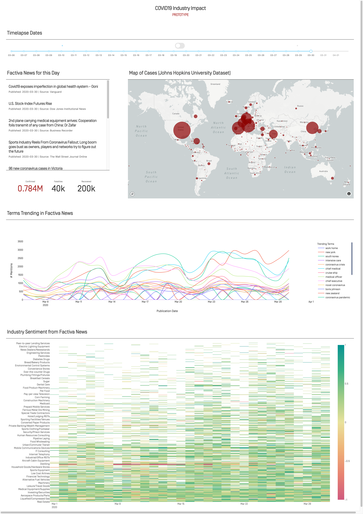

# COVID-19 Soluttion Pattern
As the COVID-19 pandemic evolves, industry leaders require a holistic view of the issue to be able to make smart decisions.

This pattern leverages Dow Jones and public datasets to build a time-lapse dashboard that shows COVID-19’s global impact on people, industries and regions. It uses data visualization tools and data science techniques to identify industry news sentiment and coverage patterns to achieve this.

## Solution

The solution consumes Dow Jones news and industry datasets via the Factiva Snapshots API.

The data for this solution comes from developers’ first-party industry lists and the following third-party public dataset:

Center for Systems Science and Engineering (CSSE) at Johns Hopkins University (JHU)


This solution is built inside a Heroku container, which hosts a Flask App for data processing and a Dash app for display. Graph objects are being synced/connected via a single controller within the Dash app and mapping tiles are provided via Mapbox.

Bi-gram frequency is calculated using Natural Language ToolKit (NLTK) and sentiment is calculated using a simple Text-Blob approach in order to reduce processing time.

## Architecture

The application back-end processing is done by leveraging Python to extract, clean, enrich and aggregate files. This processing enables clean input for the solution’s dashboard.



## Installation
- Install python 3 and pip

- Install the dependencies from `requirements.txt`

- Run `pip install -r requirements.txt`

## Run
- It is recommended to have a virtual environment
- From cli run:
```
    virtualenv venv 
    source venv/bin/activate
    
    gunicorn app:server
```
